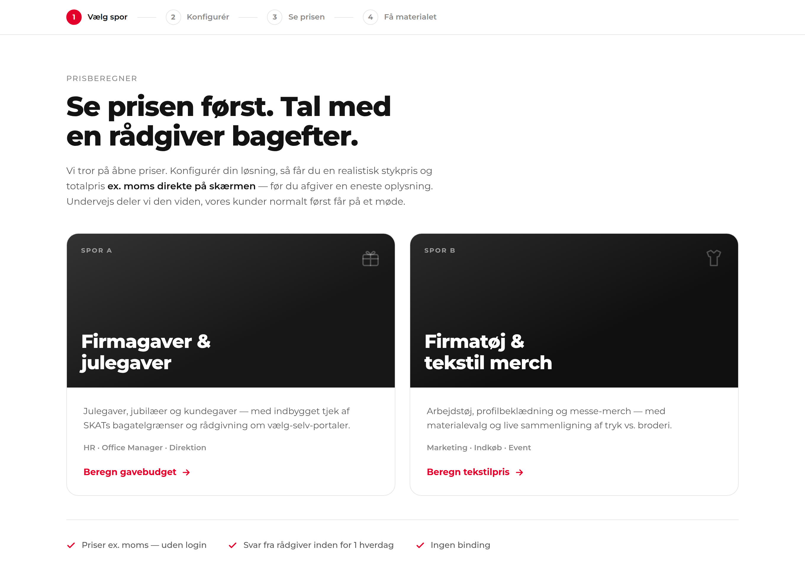
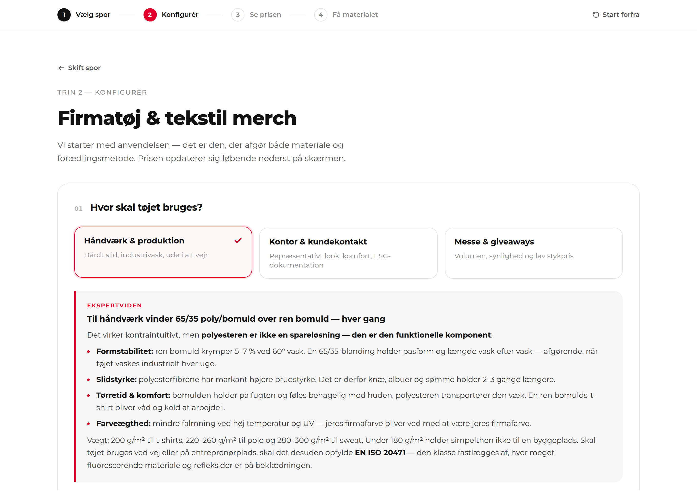
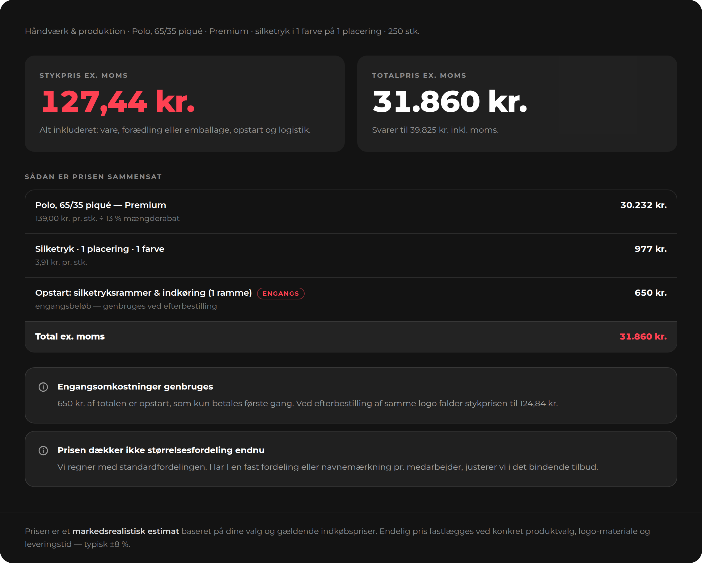
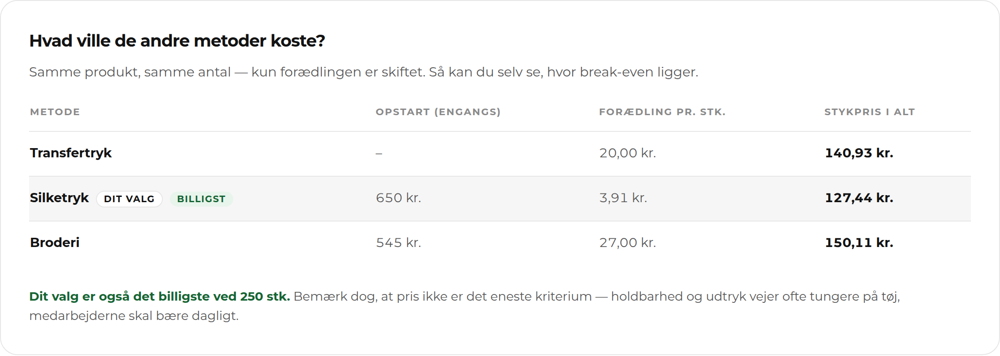
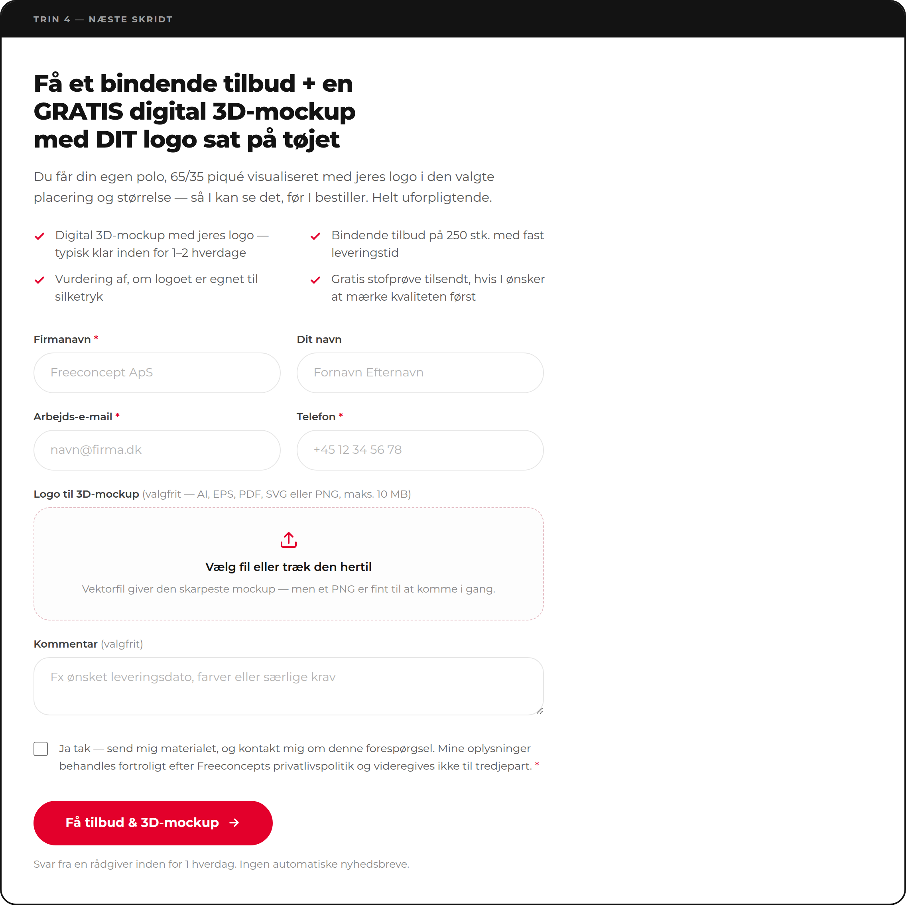
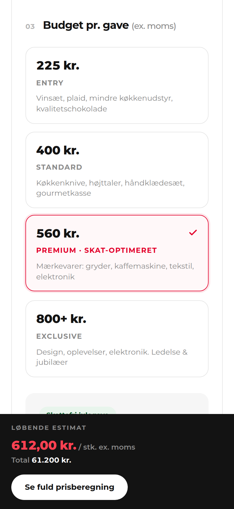

# Freeconcept — Interaktivt lead-genereringsmodul

Et lead-genereringsmodul til freeconcept.dk, der **viser prisen på skærmen, før
kunden bliver bedt om sine kontaktoplysninger**. Undervejs deler modulet den
faglige viden — SKATs gavegrænser, materialevalg, tryk vs. broderi — som
kunderne normalt først får på et møde.

Alt ligger i **én selvstændig HTML-fil**: `freeconcept-lead-modul.html`.
Ingen build, ingen npm. Kun Tailwind via CDN og Montserrat fra Google Fonts.

## Se modulet live

| | |
|---|---|
| **Åbn i browseren** | [htmlpreview.github.io](https://htmlpreview.github.io/?https://github.com/jimhoeeg/Freeconcept/blob/claude/freeconcept-lead-generator-alkd4y/freeconcept-lead-modul.html) · [raw.githack.com](https://raw.githack.com/jimhoeeg/Freeconcept/claude/freeconcept-lead-generator-alkd4y/freeconcept-lead-modul.html) |
| **Permanent URL** | Slå GitHub Pages til under *Settings → Pages* og vælg denne branch. Modulet ligger så på `https://jimhoeeg.github.io/Freeconcept/freeconcept-lead-modul.html` |
| **Lokalt** | Hent filen og åbn den — den virker direkte fra skrivebordet |

> De to preview-tjenester er tredjeparter, der henter filen fra GitHub. De kræver,
> at repoet er offentligt. Er det privat, brug GitHub Pages eller den lokale fil.

## Sådan ser det ud

### Trin 1 — vælg spor


### Trin 2 — konfigurator med ekspertviden
Hvert valg udløser en videnboks. Her forklares det, at polyesteren i en 65/35-blanding
ikke er en spareløsning, men den funktionelle komponent.


### Trin 3 — åben pris, før der spørges om noget
Stykpris, totalpris og fuld specifikation af, hvad hver krone dækker.


Alle tre forædlingsmetoder regnes på kundens eget antal, så break-even bliver synlig:


### Trin 4 — lead-formularen ligger under prisen


### Mobil


## Flow

1. **Vælg spor** — Spor A: Firmagaver & julegaver · Spor B: Firmatøj & tekstil merch
2. **Konfigurator** — dynamisk skema pr. spor, hvor hvert valg udløser en ekspert-videnboks
3. **Åben prisberegner** — stykpris og totalpris ex. moms vises **før** kontaktoplysninger
4. **Lead-capture** — formular direkte under prisen, tilpasset det valgte spor
5. **Kvittering** — leder videre til kategorisiderne, så kunderejsen fortsætter

To ting gør modulet interaktivt frem for statisk:

- **Live skattestatus (spor A)** — vælges 800-båndet til en julegave, skifter feltet
  straks til "Skattepligtig" og forklarer hvorfor.
- **Metodesammenligning (spor B)** — ved 25 stk. peger den på transfertryk, ved 250 stk.
  på silketryk. Advarer også ved kombinationer, der ikke kan lade sig gøre
  (silketryk på softshell, broderi på 150 g/m²).

## Designlinje

Modulet følger freeconcept.dk 1:1:

| Element | Værdi |
|---|---|
| Flade | Hvid, `#131313` tekst, `#5A5A5A` / `#8A8A8A` grå |
| Accent | `#E3002B` (SportDirect-rød) på CTA'er, valgte kort og aktivt trin |
| Hårstreg | `#E6E6E6` · dis `#F6F6F6` |
| Skrift | Montserrat — 800 display, 700 kort, 600 labels, 400/500 brødtekst |
| Former | 20 px runde kort, pilleformede felter og knapper som sitets søgefelt |

Modulet har **bevidst ingen egen header med logo og menu** — den står allerede
øverst på siden. Trinindikatoren er heller ikke sticky, fordi sitets egen header
er fastlåst, og to klæbende bjælker ville dække indholdet.

## Indsæt på hjemmesiden

**WordPress (anbefalet):** opret en ny side, tilføj blokken *Custom HTML* /
*Egen HTML* og indsæt hele filens indhold. Modulet har sit eget navnerum
(`#fc-app` og klasser med `fc-`-præfiks), så det kolliderer ikke med temaets styles.

**Iframe (mest isoleret):**

```html
<iframe src="/moduler/freeconcept-lead-modul.html"
        style="width:100%;border:0;min-height:1400px" title="Prisberegner"></iframe>
```

**Andre CMS:** filen kan bruges som selvstændig side, som den er.

## Tilpasning

Alt, der normalt skal justeres, ligger samlet øverst i `<script>`-blokken:

| Sted | Hvad det styrer |
|---|---|
| `FC_CONFIG.endpoint` | Formular-endpoint (Formspree, HubSpot, WP `admin-ajax`, eget API). Er den tom, kører modulet i demo-tilstand og logger leadet i browserkonsollen. |
| `FC_PRICING` | Alle priser: emballage, håndtering, fragt, mængderabatter, opstart og pris pr. tryk/broderi. |
| `FC_PRODUCTS` | Produktkatalog pr. anvendelse med priser for Basis / Premium / GOTS. |
| `FC_LINKS` | URL'er til jeres kategorisider. Vises på kvitteringen, så kunden kan kigge videre. Står som `/firmatoj` og `/merchandise` og skal rettes til jeres faktiske stier. |
| `KB` | Teksterne i ekspert-videnboksene. |
| `FC_PRICING.tax2026` | Beløbsgrænser for julegave, bagatelgrænse, reklameartikel og jubilæumsgratiale. |
| `tailwind.config` | Farvepaletten. |

### Leadet

Formularen sender hele konfigurationen med som skjulte felter, så sælgeren kan se
præcis, hvad kunden har regnet på:

`fc_track`, `fc_config`, `fc_unit_price`, `fc_total_price`, `fc_quantity`, `fc_source`
— plus `company`, `name`, `email`, `phone`, `note` og `logo` (kun spor B).

Afsendelsen bruger `FormData`, så logo-upload virker uden ekstra opsætning, hvis
endpointet accepterer `multipart/form-data`.

## Før produktion

1. **`FC_CONFIG.endpoint` er tom.** Modulet logger leadet i konsollen i stedet for
   at sende det. Intet lead når frem, før jeres endpoint er sat ind.
2. **`FC_PRICING` er markedsrealistiske estimater**, ikke Freeconcepts kostpriser.
   Tallene opfører sig rigtigt — break-even for silketryk lander omkring 40–75 stk.
   — men marginerne skal være jeres egne.
3. **Skattesatserne** er generel information for indkomståret 2026 (julegavegrænse
   900 kr., bagatelgrænse 1.300 kr., begge inkl. moms). Kontrollér dem ved årsskifte;
   de står samlet i `FC_PRICING.tax2026`.
